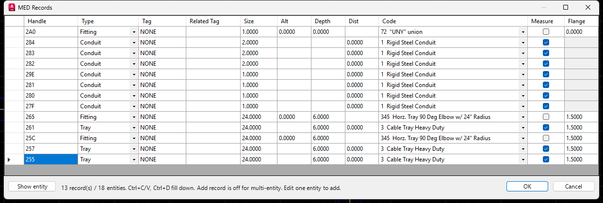

# MEDRECORDS

Commands: `MEDRECORDS`, `MEDXDEDIT`.

Handle-based grid for multi-xdata picks. Opens from the command or from MED Properties **Edit records...**. Uses the implied pick set, or prompts for an entity if nothing is selected.

MEDRECORDS grid and Show halo.

## Grid

Columns: Handle (read-only), Type (MEDType dropdown: Conduit / Cable / Tray / Fitting / Equipment), Tag, Related Tag, Size/Count, Alt, Depth, Dist, Code (dropdown from `MEDType`), Measure, Flange.

Size/Count is conduit/tray size, or cable quantity; Equipment has no Size.

No Description column. Flange is only enabled for Tray and Fitting.

- One entity: blank row adds a record.
- Multi-entity: Add is off. Edit one entity to add.
- Ctrl+C / Ctrl+V, Ctrl+D fill down.

## Show

**Show entity** (or context menu) half-zooms to the current row's entity, draws a yellow halo, then restores the view and pick set when the dialog closes.
