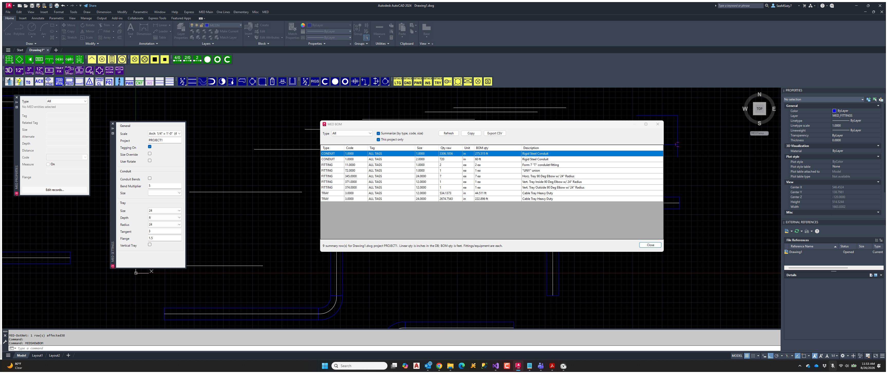

# MEDSHOWBOM

Commands: `MEDSHOWBOM`, `MEDSHOW`. Alias `MEDSHOWSUM` opens with Summarize checked.

Current-drawing BOM from `MEDProject` for the active DWG name. Same idea as the 2012 SHOW browse: look at the extract; run BOM first if the grid is empty.

MEDSHOWBOM dialog.

## Filters

Type: All, Conduit, Cable, Tray, Fitting, Equipment (assemblies). Equipment is `ITEM_TYPE=EQUIP`. Qty for equipment and fittings is each. Conduit / cable / tray qty in the table is inches; BOM qty is feet (`raw / 12`).

- **This project only** — limit to `_MEDPROJECT`.
- **Summarize (by type, code, size)** — rolls tags to `ALL TAGS`.
- Refresh, clipboard **Copy**, **Export CSV**.
